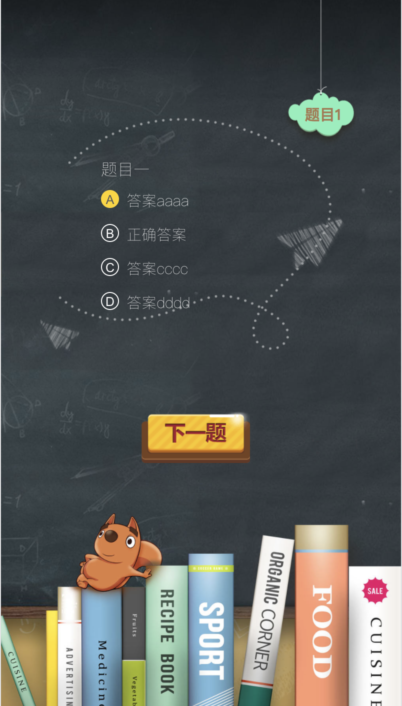

# vue-vuex-study

> tag：vue vuex router
>
>一套简单的学习代码
>
>试卷测试 学习vuex 思想

## Build Setup

``` bash
# install dependencies
npm install

# serve with hot reload at localhost:8080
npm run dev

# build for production with minification
npm run build
```



